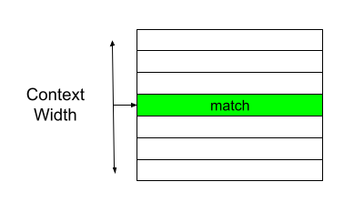
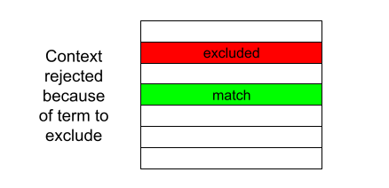
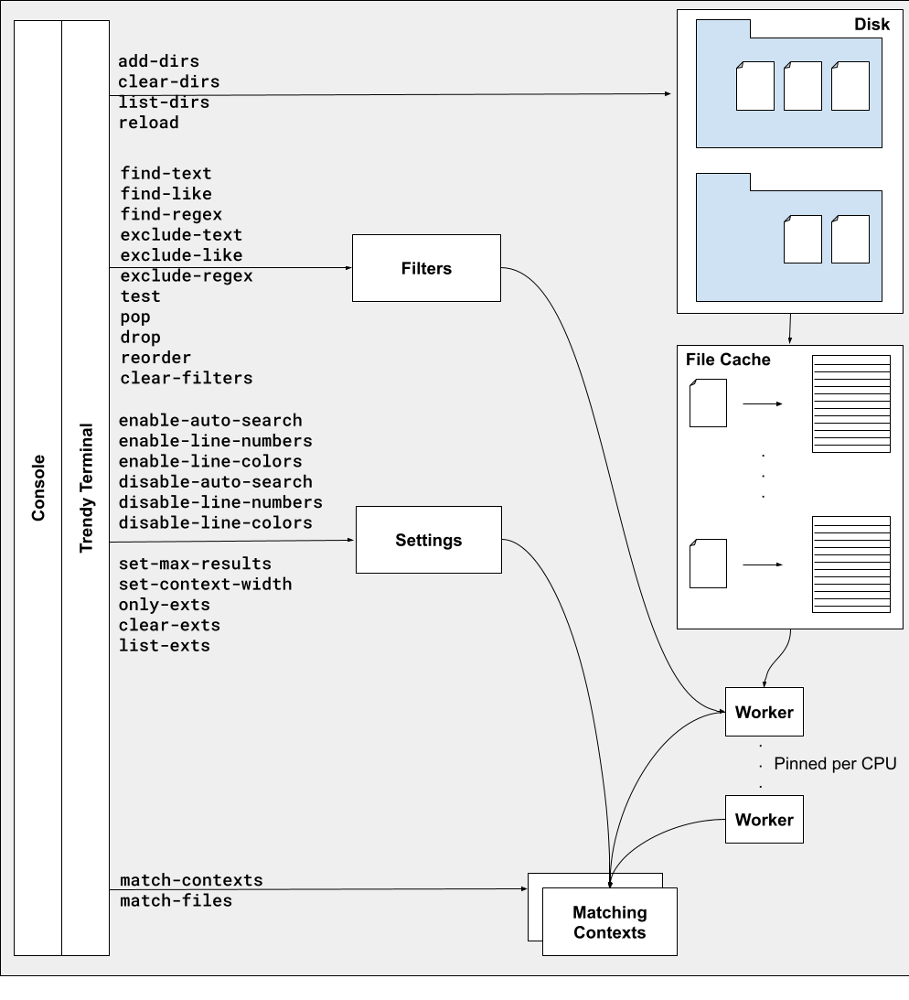

# septum

[](https://alire.ada.dev/crates/septum.html)
[](https://github.com/pyjarrett/septum/actions)
[](https://github.com/pyjarrett/septum/actions)

Context-based code search tool

# What does this do?

Septum is like `grep`, but searches for matching contexts of contiguous lines,
rather than just single lines.



Limiting the search into blocks around search terms allows searching for elements
in arbitrary order which may span across lines, in a way which can be difficult
to express in other tools. Sometimes terms appear multiple times in a project and
have names which change based on context. Septum allows exclusion of these contexts.



# Why does this exist?

Finding what you need in large codebases is hard.  Sometimes terms have multiple
meanings in different parts of the project, and figuring out what you're looking
for needs to be done in an incremental fashion.

Septum provides an interactive environment to push and pop search filters
to narrow or expand a search.

Septum is designed to be a standalone application for the lone developer on
their own hardware, searching closed source software. This means the program
should use a minimum number of dependencies to simplify security auditing and
perform no network operations.



# Example

[](https://asciinema.org/a/459292)

# Building

1. This project requires a recent release of the [Alire](https://github.com/alire-project/alire/releases) tool to build.
2. Install a toolchain.

```bash
alr toolchain --select
```

3. Build

```bash
alr build
```

4. Executable should be at `bin/septum(.exe)`

# Installation

> Septum is currently available as a prerelease beta.

**Windows Chocolatey** users can it in the [Chocolatey Community Repository](https://community.chocolatey.org/packages/septum/):

```powershell
choco install septum --version=0.0.7
```

# Contributing

Septum aims to help every developers everywhere.  You're encouraged to recommend
features, report bugs, or submit pull requests.

# License

Septum is released under the [Apache 2.0 License](http://www.apache.org/licenses/LICENSE-2.0)
