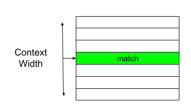
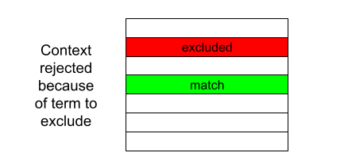

# Septum

[](https://alire.ada.dev/crates/septum.html)
[](https://github.com/pyjarrett/septum/actions/workflows/build-all.yml)
[](https://github.com/pyjarrett/septum/actions/workflows/build-artifacts.yml)

[](https://ada-lang.io/)
[](https://www.adacore.com/blog/ada-spark-crate-of-the-year-2021-winners-announced)

---

Context-based code search tool, written in Ada

[](https://asciinema.org/a/459292)

# Use Case

Finding what you need in large codebases is hard.  Sometimes terms have multiple
meanings in different parts of the project, and figuring out what you're looking
for needs to be done in an incremental fashion.

Septum provides an interactive environment to add and remove search filters
to narrow or expand a search.

# What does this do?

Septum provides interactive searching of a codebase for blocks of lines which
contain the terms you want, and exclude the terms you don't want.

It's different from `grep` by interactively allowing filters to be added and
removed, and focusing on multiple line groups.  If you're doing a search looking
for something on a specific line, you probably want to use `grep` (or `ripgrep`).
If you're looking for a block of code with a bunch of terms in those lines
and want to whittle it down since they appear in a lot of places, you probably
want to use Septum.  Using a context width of 0 approximates an interactive grep.



Limiting the search into blocks around search terms allows searching for elements
in arbitrary order which may span across lines, in a way which can be difficult
to express in other tools. Sometimes terms appear multiple times in a project and
have names which change based on context. Septum allows exclusion of these contexts.



Filters get applied in turn with contexts being removed at every step.  Similar
contexts get deduplicated before presented to cut out more clutter.

# Example session

```
# Start interactive search
$ septum

# Following commands are all interactive within septum
# Omitting printed context results here for brevity.

# Load something to search
> add-dirs D:/dev/ada/septum

# Turn on config flag to always immediately search after changing filters
# You would need match-contexts or match-files after each filter change
# to do searching otherwise.
enable-auto-search

# See how much to search.
> stats
Files:  697
Lines:  26342

# Apply some filters
> find-like Make

Matching contexts:  184
Matching files: 69

# Exclude some directories we don't want in the results
> exclude-path cache/dependencies

Matching contexts:  97
Matching files: 21

# The search found a bunch of Make_Commands, but that's not
# what I want.
> exclude-like Make_Command

Matching contexts:  45
Matching files: 21

# Exploded_Line also has a Make function, not related to what I want.
> exclude-like Exploded_Line

Matching contexts:  35
Matching files: 18

# I'm looking for the Make version, not the Make_Null version
> exclude-like Mkae_Null

# Oops, made a typo, remove just last filter.
> pop

> exclude-like Make_Null

Matching contexts:  22
Matching files: 16

# OK, found what I needed

# Exit the interactive session
> exit
```

At program start, commands get loaded and run from `.septum/config` in the
current and ancestor directories, and `%LOCALAPPDATA%/septum/config` on
Windows or `$XDG_CONFIG_HOME` on Mac/Linux, which defaults
to `~/.config/septum/config`.

You can create a starter config file in a directory with `septum init`.

An example config file might contain:

```
# Turn on config flag to always immediately search after changing filters
enable-auto-search

# Set the maximum number of returned results
set-max-results 20

# Default directories to load
add-dirs /Users/me/dev/ada/septum
```

# Philosophy

Septum is designed to be a standalone application for the lone developer on
their own hardware, searching closed source software. This means the program
should use a minimum number of dependencies to simplify security auditing and
perform no network operations.

Usually Septum is used interactively, but it also can be used in scripts and
pipelines using the `run` command.

```
septum run complicated_search.septum > results.txt
```

# Performance

Septum keeps the search directories in memory and parallelizes searches across
all available cores.  Anecdotally this equates to ~100 MB per 1 million lines of
code, and ~6 millions lines of code searched per second on an Mac M1 Air with
8 cores (4 performance and 4 efficiency cores).  This makes it reasonable to
use on a developer machine for codebases with dozens of millions of lines
of code.

# Installing

Self-contained binaries are available on the [releases page](https://github.com/pyjarrett/septum/releases).
[Nightly binaries are available](https://github.com/pyjarrett/septum/actions/workflows/build-artifacts.yml) if you prefer a bleeding edge release.

# Building

1. This project requires a recent release of the [Alire](https://github.com/alire-project/alire/releases) tool to build.
2. Install a toolchain.

```bash
alr toolchain --select
```

3. Build

```bash
alr build --release
```

4. Executable should be at `bin/septum(.exe)`

## Parallel development with other crates

Septum development between releases often coincides with additional development
in the [Trendy Terminal](https://github.com/pyjarrett/trendy_terminal) and
[Progress Indicators](https://github.com/pyjarrett/progress_indicators) crates.

Due to delays in Alire crate acceptance, you might need to pull those crates into
the same parent directory as septum if the `main` branch is pinned to either or both of
these:

```
    some_common_parent_dir/
        septum/
        progress_indicators/
        trendy_terminal/
```

If you need a stable release, check out the most recent git tag.

# Testing

Integration tests use [BBT](https://github.com/LionelDraghi/bbt).

Run these like:

```
bbt --exec_dir . --recursive docs/tests --verbose --strict --tmp_dir bbt_out --output integration_test_results.md
```

# Contributing

Septum aims to help every developers everywhere.  You're encouraged to recommend
features, report bugs, or submit pull requests.

# License

Septum is released under the [Apache 2.0 License](http://www.apache.org/licenses/LICENSE-2.0)
